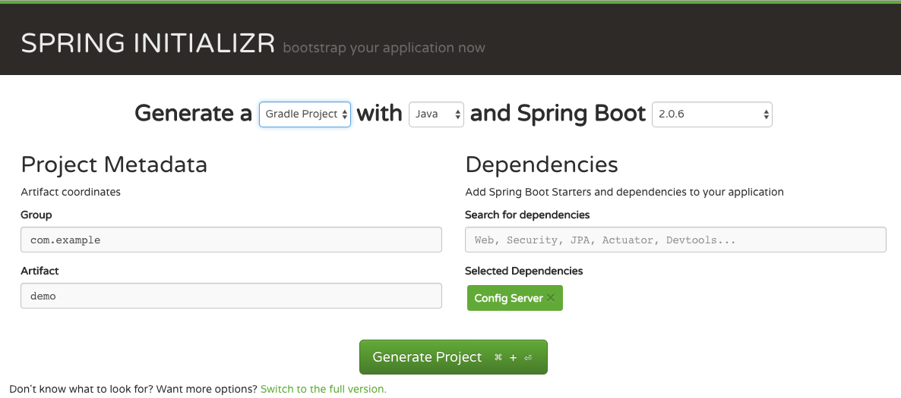
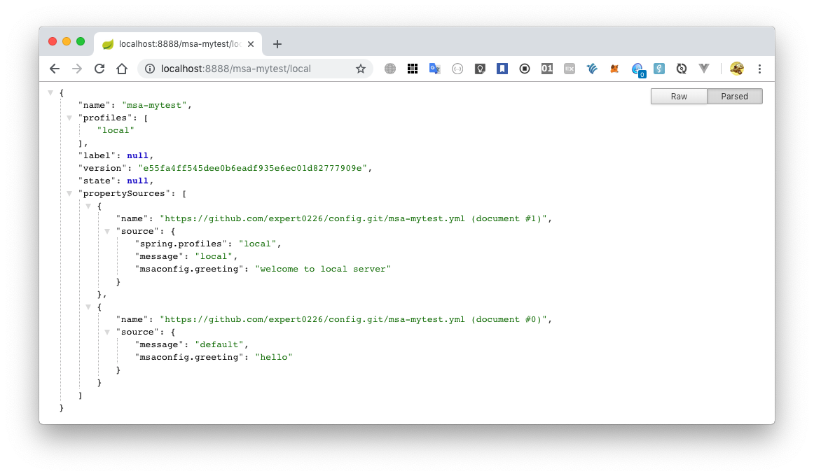
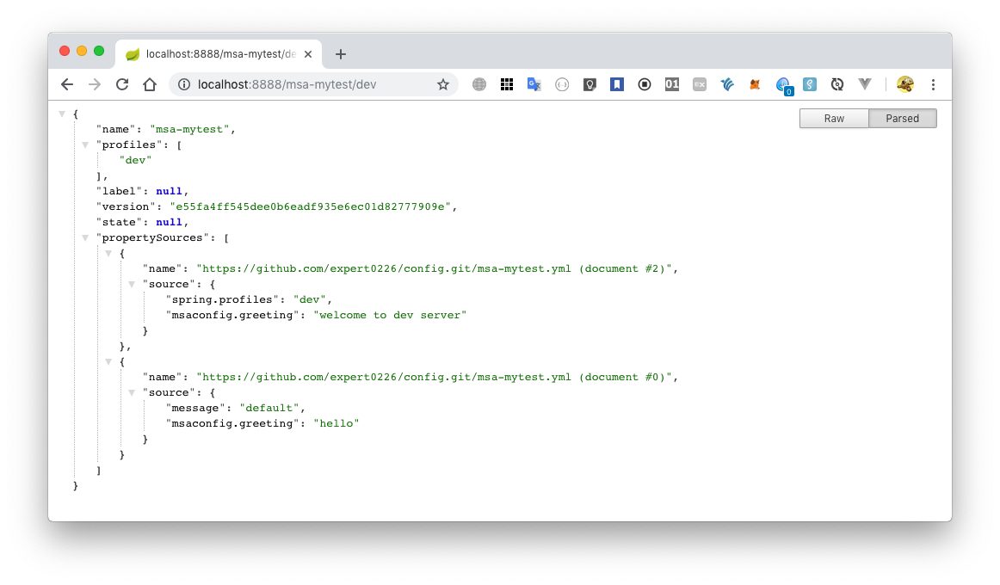

:toc:
:numbered:
:source-highlighter: pygments

= 설정 서버

== Git 저장소에 프로젝트별 설정 파일 생성

GitHub 에 Git 저장소를 생성해 준다. +
필자의 설정 서버용 Git 저장소는 다음과 같다.

https://github.com/expert0226/config.git

필자가 작성할 프로젝트는 msa-mytest 라는 이름을 갖고 있음으로
msa-mytest.yml 파일을 아래와 같이 설정해 주었다. +
(개인 취향에 따라 .properties 파일로 만들어도 상관 없다)

[source,yml]
[subs="QUETOS"]
----
message: default

msaconfig:
  greeting: "hello"

---
spring:
  profiles: local

message: local

msaconfig:
  greeting: "welcome to local server"

---
spring:
  profiles: dev

msaconfig:
  greeting: "welcome to dev server"

---
spring:
  profiles: test

msaconfig:
  greeting: "welcome to test server"

---
spring:
  profiles: staging

msaconfig:
  greeting: "welcome to staging server"

---
spring:
  profiles: prod

msaconfig:
  greeting: "welcome to prod server"
----

TIP: yml 파일의 경우 한 파일에 다수의 프로파일을 저장할 수 있다. +
properties 파일의 경우 프로파일별로 별도의 파일을 만들어 주어야 한다. +
yml 파일의 경우 key 경로를 tab 또는 띄어쓰기로 위 파일과 같이 줄여서 쓸 수 있다. +
properties 파일의 경우 중복되는 경로로 계속 써주어야 한다.

== Config Server 생성

start.spring.io 에 접속해서 "Config Server" 를 추가해서 zip 을 다운로드하고 프로젝트로 import 하거나 툴에서 SpringBoot 를 지원한다면 툴에서 지원하는 방법으로 프로젝트를 생성한다.

생성 후의 build.gradle 파일은 아래와 같다.
(역시 Maven 을 사용하는 것은 취향의 문제)

[source,grove]
[subs="quotes"]
----
buildscript {
	ext {
		springBootVersion = '2.0.6.RELEASE'
	}
	repositories {
		mavenCentral()
	}
	dependencies {
		classpath("org.springframework.boot:spring-boot-gradle-plugin:${springBootVersion}")
	}
}

apply plugin: 'java'
apply plugin: 'eclipse'
apply plugin: 'org.springframework.boot'
apply plugin: 'io.spring.dependency-management'

group = 'com.example'
version = '0.0.1-SNAPSHOT'
sourceCompatibility = 1.8

repositories {
	mavenCentral()
}

ext {
	springCloudVersion = 'Finchley.SR2'
}

dependencies {
	#implementation('org.springframework.cloud:spring-cloud-config-server')#
	testImplementation('org.springframework.boot:spring-boot-starter-test')
}

dependencyManagement {
	imports {
		mavenBom "org.springframework.cloud:spring-cloud-dependencies:${springCloudVersion}"
	}
}
----

main 함수가 포함된 class 에 #@EnableConfigServer 애너테이션을 붙여주자.

[source,java]
[subs="quotes"]
----
package com.heaven.msa;

import org.springframework.boot.SpringApplication;
import org.springframework.boot.autoconfigure.SpringBootApplication;
#import org.springframework.cloud.config.server.EnableConfigServer;#

#@EnableConfigServer#
@SpringBootApplication
public class MyconfigserverApplication {

	public static void main(String[] args) {
		SpringApplication.run(MyconfigserverApplication.class, args);
	}
}
----

Config Server 가 Git URL 에 접근할 수 있도록 설정 파일(src/main/resources/application.yml) 에 다음 내용을 추가한다.

[source.yml]
[subs="quotes"]
----
# default: 8080
server.port: 8888

spring:
  application:
    name: msa-myconfigserver
  cloud:
    config:
      server:
        git:
          uri: https://github.com/expert0226/config.git
----

이제 브라우저에서 http://{confing-server}/{project-name}/{profile-name} 을 입력해서 결과를 확인해 보자.

* my-test 프로젝트의 local 프로파일 읽어 오기

* my-test 프로젝트의 dev 프로파일 읽어 오기

다른 profile 에 해당하는 정보도 같은 방법으로 확인할 수 있다.

